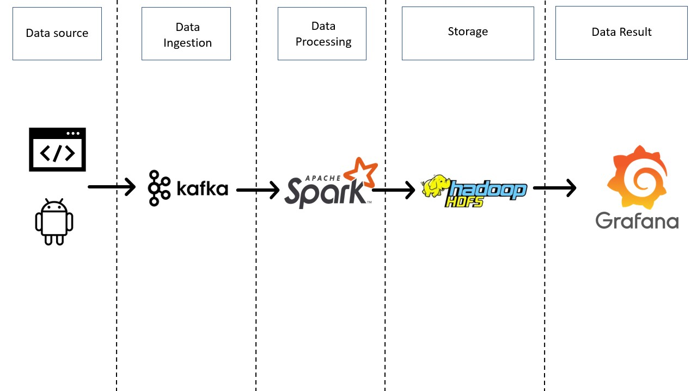

# Apelie-Dashboard
Undergraduate final project of the software engineering course at PUC-Campinas.

## About

Apelie is a platform focused on selling and buying handmade products, for people looking for an e-commerce that focuses on this type of product. In addition to the web platform and the android application it also has a dashboard where it will be possible to analyze the data provided by users

## Project Architecture

## Data Ingestion

  The <a href="https://kafka.apache.org/">Kafka</a> framework will be handling the data ingestion, where it will get the data and directly from the Web-page and mobile application and send it to spark, where the data will be processed
   
  Kafka was chosen because of the fact that it has a High-throughput being capable of handle a high-volume data, is fault-tolerant and can be scaled-out horizontally

## Data Processing

  The <a href="http://spark.apache.org/">Spark</a> will receive the data from kafka and will process it
   
  Apache spark was chosen because it has a High speed data querying, analysis, and transformation. Comparing to Hadoop MapReduce, spark enable multiple map operations in memory instead of needs to write interim results to a disk.
 

## Storage

  The Hadoop Distributed File System (<a href="https://hadoop.apache.org/docs/r1.2.1/hdfs_design.html">HDFS</a>) will storage the data that was processed by spark
   
  HDFS was chosen because is fault-tolerant, can be scaled-out horizontally and is easily integrated with other frameworks

## Data Result

  After all the process the data results metrics will be shown on <a href="https://grafana.com/">Grafana</a>
   
  Grafana was chosen because it has a friendly UI and is easy to integrate with several frameworks

